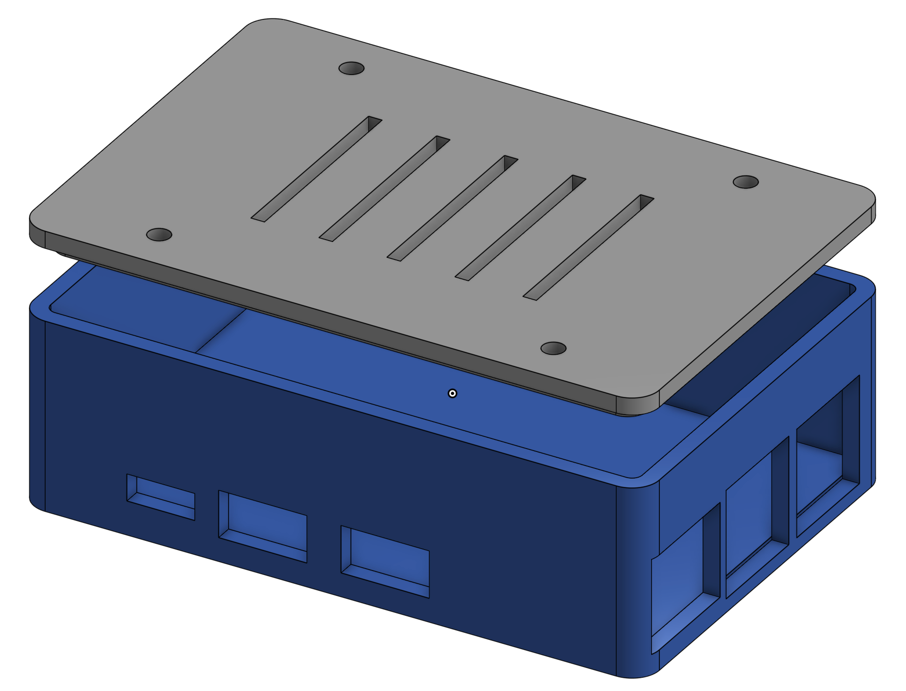
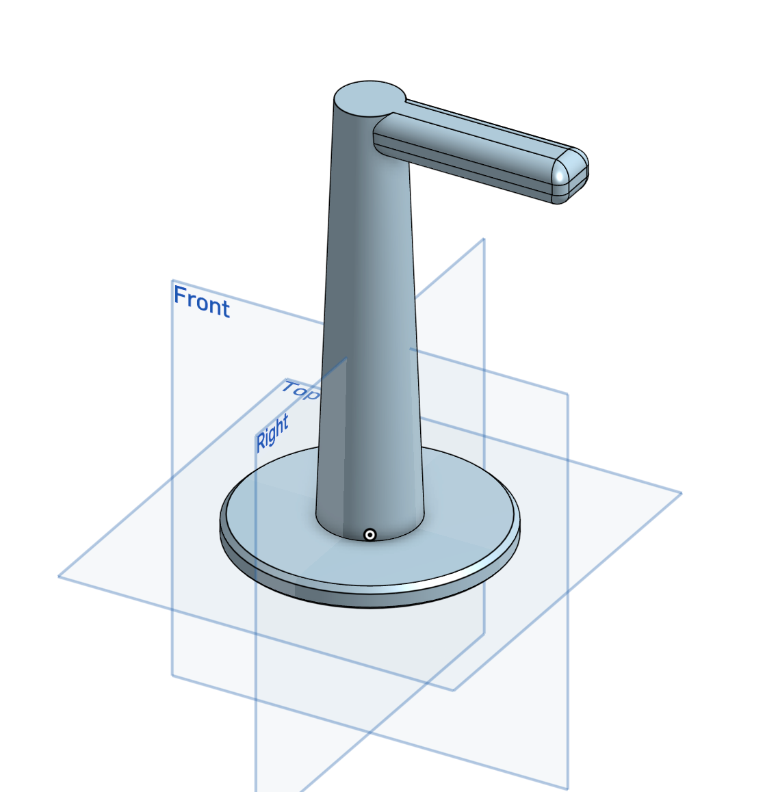
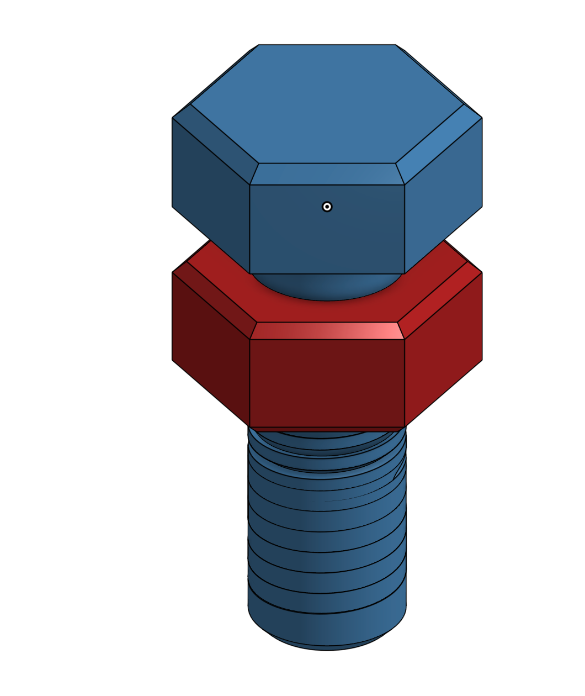
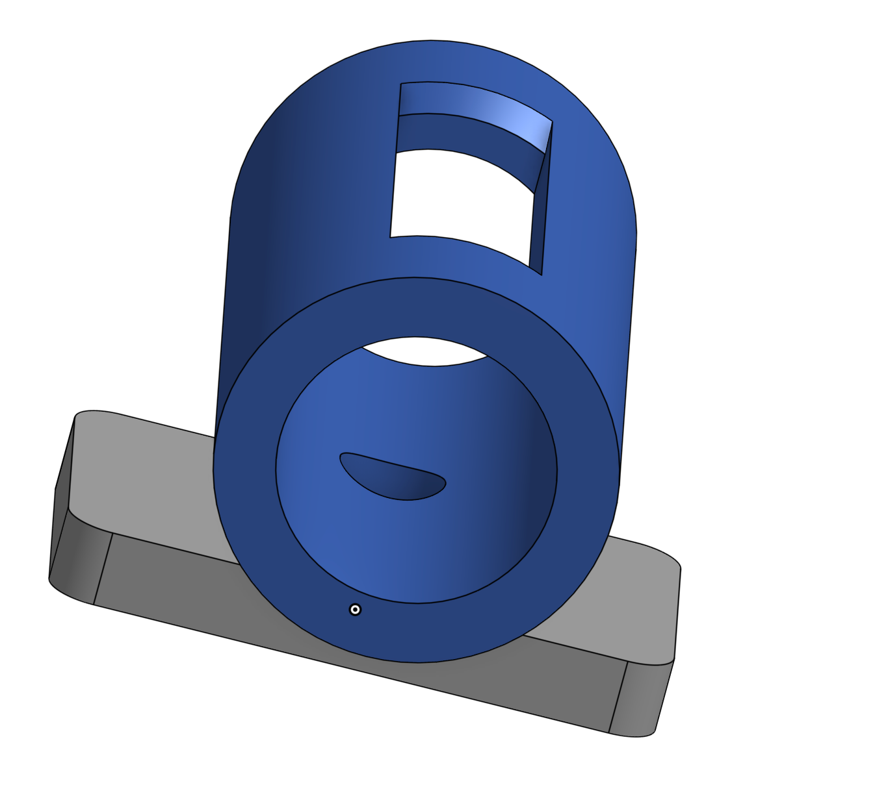

# Example Gallery

Real parts built through CAiD MCP tools. Each example highlights workflow features that set CAiD apart: geometry validation, query-before-modify, section views for verification, and measurement for fit checking.

---

## Raspberry Pi Case

**Prompt:** *"Design a Raspberry Pi 4 case: rounded box with 2.5mm walls, port cutouts for USB, Ethernet, HDMI, and USB-C power, plus four internal screw standoffs on the Pi mounting pattern."*

**Tool sequence:**
1. `create_box` — outer shell (92x62x28mm)
2. `fillet_edges` — round vertical corners
3. `shell_object` — hollow to 2.5mm walls, open top
4. `section_view` — **verify wall thickness before cutting ports**
5. `create_box` x6 — cutout tools for each port (USB, Ethernet, HDMI, USB-C)
6. `translate_object` — position each cutout on the correct face
7. `boolean_cut` x6 — **validation confirms each cut reduced volume**
8. `run_cadquery_script` — screw bosses (escape hatch for internal features)
9. `section_view` — **final verification: walls, bosses, and ports in cross-section**
10. `measure_object` — confirm dimensions and face/edge counts

**What makes this a CAiD example:**
- `section_view` lets the agent verify internal geometry it can't see from outside
- Each `boolean_cut` is validated — if a cutout misses the wall, CAiD flags it immediately
- When `boolean_union` failed on the screw bosses (OCCT limitation with shelled bodies), `run_cadquery_script` provided a working escape hatch
- `measure_object` confirms the final part has the expected complexity (31 faces, 72 edges)

---

## Headphone Stand

**Prompt:** *"Make a headphone stand: heavy circular base for stability, tall post, and a hook arm at the top with a rounded tip."*

**Tool sequence:**
1. `create_cylinder` — weighted base (r=50, h=10mm)
2. `fillet_edges` — soften the top rim
3. `boolean_union` — join base + post + arm + tip
4. `find_edges_near_point` — locate the arm-to-post junction edge for filleting
5. `measure_object` — verify total height (193mm) and volume

**What makes this a CAiD example:**
- `find_edges_near_point` identifies the exact junction edge between the arm and post — no guessing selector strings
- Boolean validation confirmed each union increased volume as expected
- When the sphere tip was placed at y=60 (touching but not overlapping), the validation **caught the zero-overlap condition** with a clear warning: *"shapes may not overlap — verify operands intersect before union"*

---

## Hex Bolt & Nut

**Prompt:** *"Model an M10 hex bolt and matching nut. Chamfer the bolt head and the thread lead-in. Place the nut beside it."*

**Tool sequence:**
1. `create_extruded_polygon` — hex head from 6-vertex polygon
2. `chamfer_edges` — bevel the bolt head top
3. `create_cylinder` — shaft
4. `boolean_union` — join head + shaft
5. `chamfer_edges` — thread lead-in on shaft bottom
6. `create_extruded_polygon` — hex nut body
7. `add_hole` — through bore for the bolt
8. `chamfer_edges` x2 — bevel both faces of the nut
9. `translate_object` — place nut beside bolt
10. `measure_object` x2 — verify both parts

**What makes this a CAiD example:**
- Every chamfer is validated — if the chamfer length exceeds half an edge, CAiD catches it
- `extruded_polygon` creates exact hex geometry from coordinate points, no approximations
- `measure_object` on the nut confirms the through-hole removed the expected volume
- Two separate objects in one scene, rendered together — shows multi-part workflow

---

## Cable Management Clip

**Prompt:** *"Design a cable management clip: flat adhesive base with a C-shaped ring that holds a cable. Include a snap-in slot at the top."*

**Tool sequence:**
1. `create_box` — flat base (20x12x3mm)
2. `create_cylinder` x2 — outer ring and inner cable channel
3. `rotate_object` — orient both cylinders horizontally
4. `boolean_cut` — subtract inner from outer to make the C-ring
5. `create_box` — slot cutter for the snap-in opening
6. `boolean_cut` — cut the slot at the top of the ring
7. `boolean_union` — join ring onto base
8. `fillet_edges` — round the base edges
9. `measure_object` — confirm final dimensions (20x12x16.7mm)

**What makes this a CAiD example:**
- Built entirely from primitive MCP tools — no scripting needed
- Each boolean is validated: the inner cut reduced volume from 2413 to 1056mm3, confirming the channel was carved correctly
- Small part (1.5cm3) shows CAiD handles fine features, not just big parts
- Took ~30 seconds of tool calls to go from nothing to a printable clip
